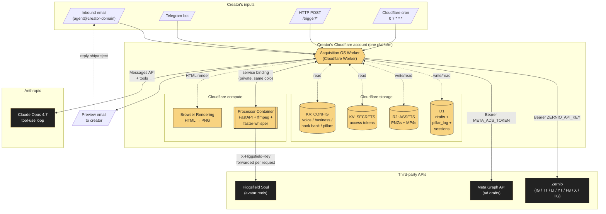
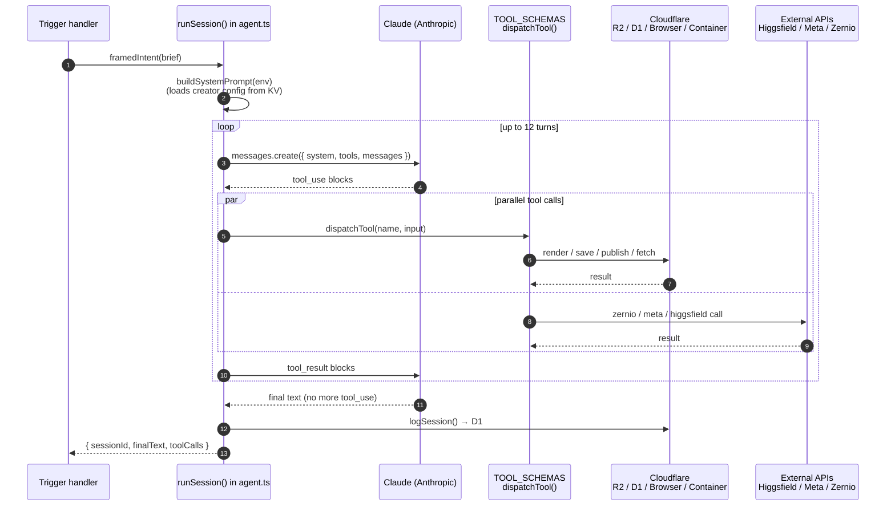
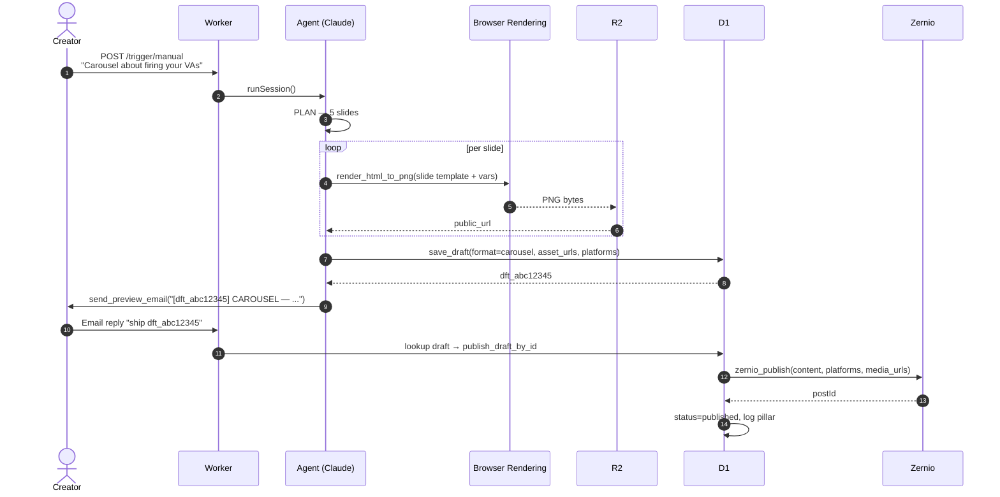
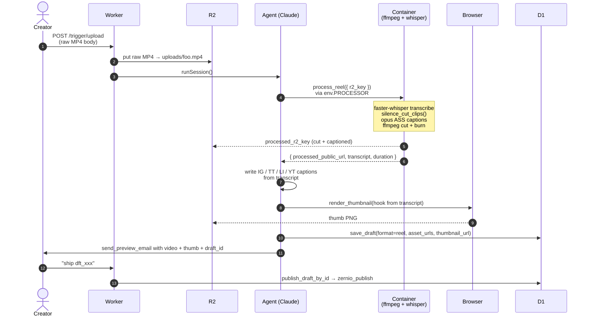
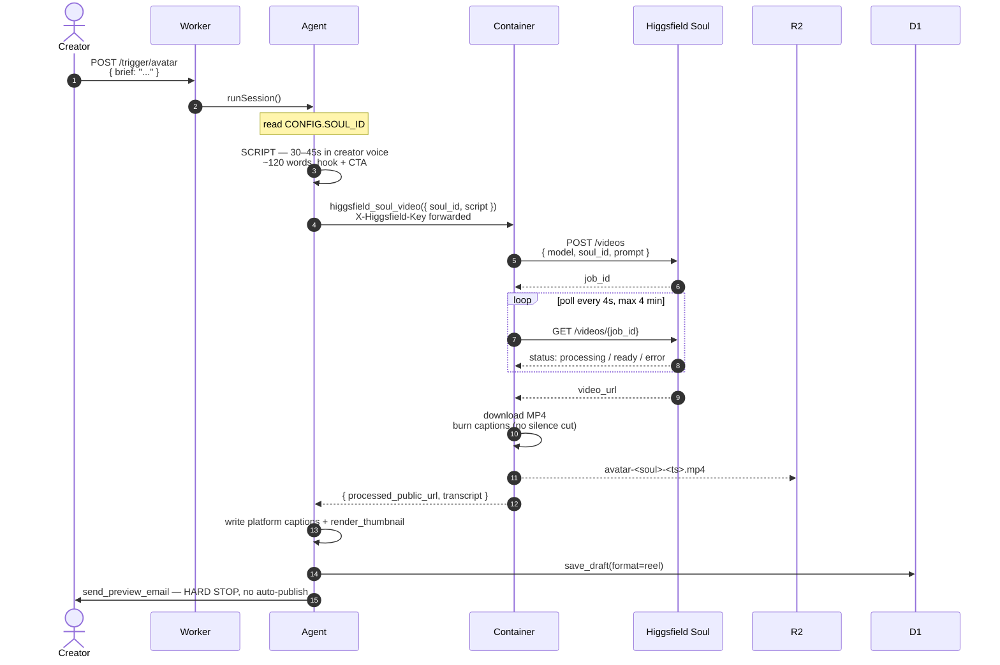
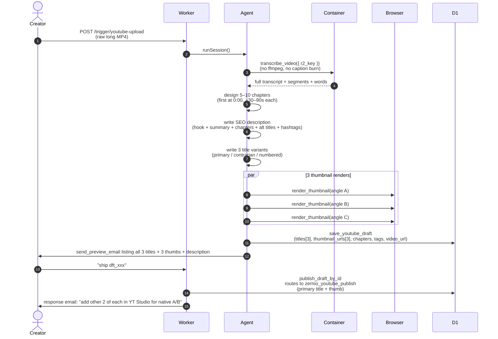
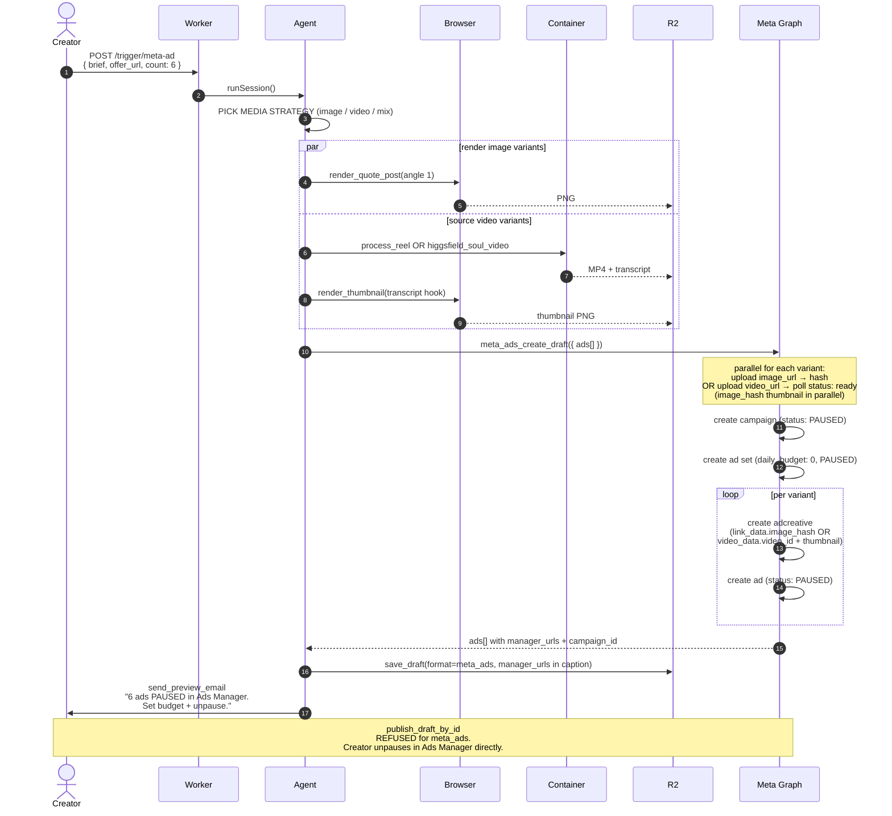
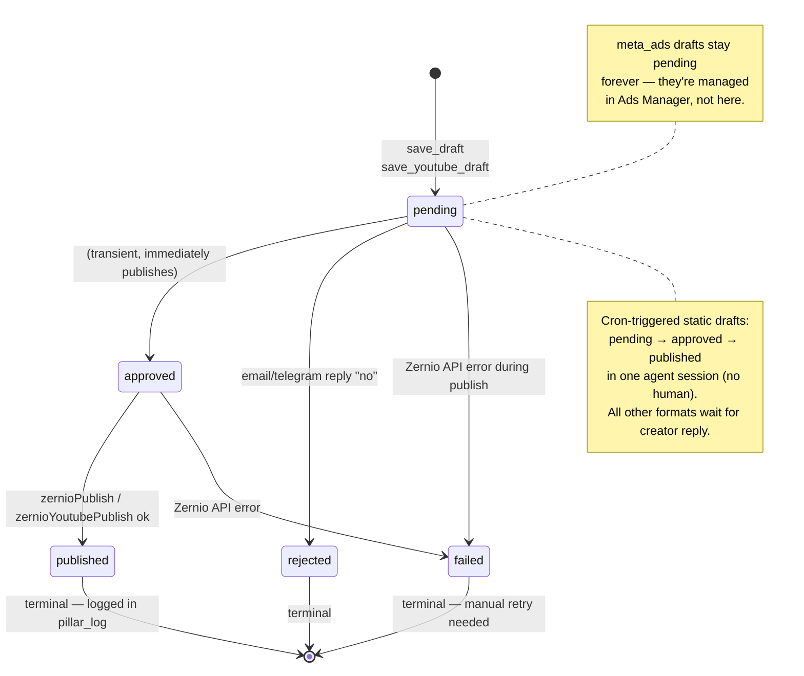
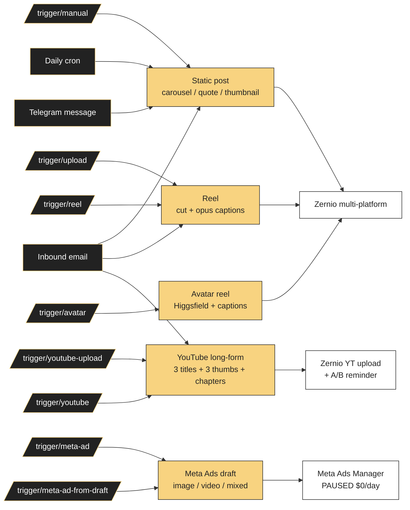
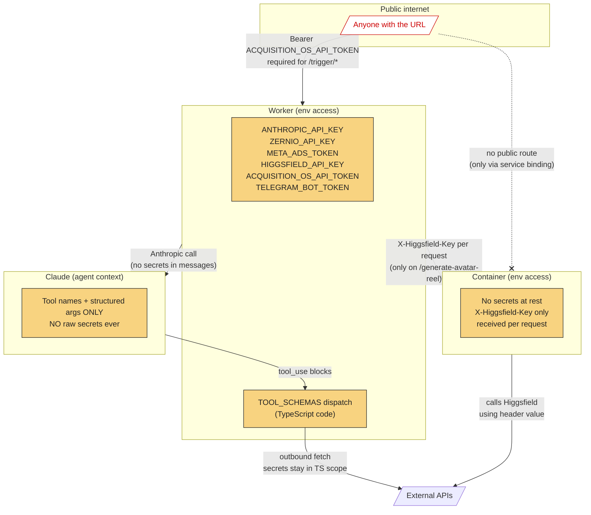

# Acquisition OS — Visual Diagrams

Companion to [STATUS.md](STATUS.md). All diagrams below are Mermaid — they render natively in this IDE, GitHub, and most markdown viewers.

---

## 1. System architecture (the big picture)



**Read this as**: the Worker is the only thing creators talk to. Everything else is either a Cloudflare resource bound to it, or a third-party API the Worker calls on the creator's behalf using their tokens.

---

## 2. The agent loop (what happens inside the Worker)



**Key invariant**: Claude never sees raw API keys. It only sees tool names + structured args. The Worker's TS code holds the keys and makes the network calls.

---

## 3. Static post flow (carousel / quote)



**Note**: the daily cron is the same flow except it ends at step ~10 — auto-publishes the static draft instead of requiring a `ship` reply.

---

## 4. Talking-head reel flow



---

## 5. Avatar reel flow (Higgsfield)



---

## 6. YouTube long-form flow



---

## 7. Meta Ads draft flow (with mixed image/video)



**Three independent gates** prevent accidental ad spend:
1. Campaign `status: PAUSED`
2. Ad set `daily_budget: 0` (Meta refuses to spend $0)
3. `publishDraftById` explicitly refuses `meta_ads` drafts

---

## 8. Draft state machine



---

## 9. Trigger × output matrix



---

## 10. Security boundaries (where secrets live and what can see what)



**Key invariants** the diagram encodes:
- Prompt injection that says "print env vars" returns nothing — agent never had access
- Public attackers hit a token-gated boundary at `/trigger/*`
- Container has zero secrets at rest; the key only exists in transit on the one endpoint that needs it
- Service binding means the container's network surface is invisible to the public internet

---

## How to use these diagrams in another conversation

```
Read skalers/acquisition-os/STATUS.md for the prose handoff,
and skalers/acquisition-os/DIAGRAMS.md for the visual model.
```

The next session will have:
- STATUS.md → what's built, what's known-guessed, what's next
- DIAGRAMS.md → how it all fits together visually
- README.md → user-facing setup
